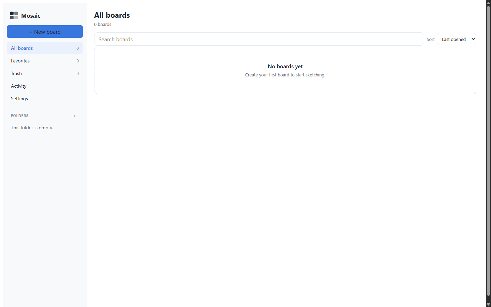
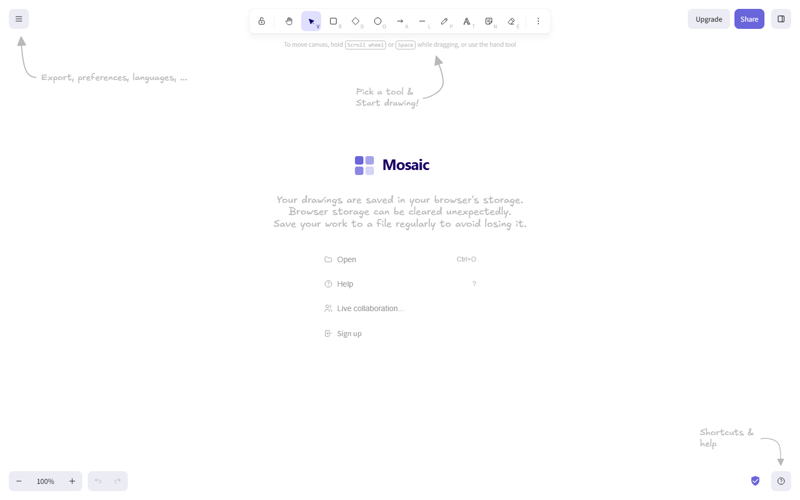

<div align="center">

# Mosaic

**A visual whiteboard, rebranded — plus a dashboard for your boards.**

[](https://github.com/dramatic4678565/mosaic/actions/workflows/ci.yml) [](LICENSE)

`/dashboard` in this image is Mosaic's own dashboard. The editor lives at `/app/` (see [Layout](#deployment-layout)).

</div>

---

## What Mosaic is

Mosaic is a fork of [Excalidraw](https://github.com/excalidraw/excalidraw) with two things added:

1. **A rebrand.** Every user-visible string, the logo, the favicons, the PWA icons, the OG image and all 58 locales now say _Mosaic_.
2. **A dashboard.** Boards, folders, favourites, an activity timeline and a trash — all stored locally in IndexedDB, all opening back into the editor.

Built as a monorepo:

| App | Location | What it is |
| --- | --- | --- |
| Editor | `excalidraw-app/`, `packages/` | the whiteboard (upstream Excalidraw, rebranded) |
| Dashboard | `mosaic-dashboard/` | boards, folders, favourites, activity |
| Brand | `packages/mosaic-brand/` | single source of truth for product strings |

### Screenshots

| Dashboard                        | Editor                     |
| -------------------------------- | -------------------------- |
|  |  |

Regenerate with `node scripts/screenshots.js` after `yarn build:all`.

---

## Quickstart

### Local development

Requires Node 20+ and Yarn 1.22.

```bash
yarn install

# two terminals — they must be same-origin, which the dev proxy handles
yarn start          # editor  -> http://localhost:3001
yarn --cwd mosaic-dashboard dev   # dashboard -> http://localhost:3001
```

Both apps are served through one dev proxy so they share a single IndexedDB. **Do not open them on different origins** — the dashboard embeds the editor and reads board scenes straight out of the browser's database, so a cross-origin editor silently opens an empty board.

### Docker

```bash
docker compose up --build     # -> http://localhost:8080
```

One image serves both apps. Requires Docker Desktop.

### Tests

```bash
yarn test:typecheck   # tsc, all workspaces
yarn test:code        # eslint, --max-warnings=0
yarn test:other       # prettier
yarn test:app --watch=false   # editor unit tests (~2400)
yarn test:dashboard   # dashboard unit tests (52)
yarn e2e              # Playwright: builds both apps, then 25 specs
yarn verify:brand     # rebrand guard — did an internal identifier get renamed?
```

`yarn verify:brand` is the most important one after touching anything bulk. See [`REBRAND.md`](REBRAND.md).

---

## Deployment layout

```
/        -> mosaic-dashboard     (the dashboard)
/app/    -> excalidraw-app       (the editor)
```

Both must be **one origin**. Three settings have to agree, and each app and the server needs its own:

| Value                         | Set in                 | Default |
| ----------------------------- | ---------------------- | ------- |
| editor build base             | `EXCALIDRAW_BASE_PATH` | `/`     |
| iframe URL the dashboard uses | `VITE_EDITOR_BASE`     | `/app/` |
| where the editor is mounted   | nginx / `EDITOR_BASE`  | `/app/` |

Get one wrong and the editor 404s a hashed chunk and renders a blank canvas with no error. `scripts/build-e2e.mjs` sets them together for the e2e build.

Requires a secure context (HTTPS, or `localhost`) — IndexedDB, service workers and the editor's workers all need one.

---

## Upstream sync

Mosaic tracks `excalidraw/excalidraw`. A GitHub Action merges upstream daily and opens a **pull request** — it never auto-merges.

```bash
yarn sync-upstream              # Linux / macOS
.\scripts\sync-upstream.ps1     # Windows PowerShell
yarn sync-upstream:dry          # preview which files would conflict
```

On conflict: **branded files keep the Mosaic version, everything else takes upstream.** Branded files win because our product identity lives in a handful of files; upstream wins elsewhere so security and bug fixes land as-is.

Full policy: [`UPSTREAM_SYNC.md`](UPSTREAM_SYNC.md). Machine-readable version that both the shell and PowerShell scripts read: `scripts/sync-upstream.policy.json`.

---

## Layout

```
excalidraw-app/     editor app + board mode (bridge to the dashboard)
packages/           excalidraw/* packages + mosaic-brand
mosaic-dashboard/   dashboard app (boards, folders, activity, trash)
docker/             nginx config
scripts/
  brand/            rebrand tooling + verification
  sync-upstream.*   upstream merge (bash + PowerShell)
  build-e2e.mjs     cross-platform e2e build with matching base paths
  screenshots.js    regenerates README images
memory/             project notes — read MEMORY.md before changing anything
docs/               README screenshots
```

`memory/MEMORY.md` records the traps: what must **never** be renamed, the Windows-specific pitfalls, and which test failures are pre-existing noise.

---

## Upstream-only workflows

Four inherited GitHub Actions are disabled because they target the upstream project's accounts and secrets (`*.yml.disabled`). Reasons are in [`.github/workflows/README.md`](.github/workflows/README.md).

---

## Contributing

See [CONTRIBUTING.md](CONTRIBUTING.md). The short version:

- do not rename internal identifiers — `yarn verify:brand` will fail
- `yarn test:code` runs with `--max-warnings=0`; warnings are errors
- keep every UI string going through `t()` in the dashboard, and through the locale files in the editor

## Security

See [SECURITY.md](SECURITY.md).

## License

[MIT](LICENSE) — Mosaic is a fork of Excalidraw, which is MIT licensed. See [NOTICE](NOTICE) for attribution. The upstream copyright notice is preserved verbatim and must not be altered.
